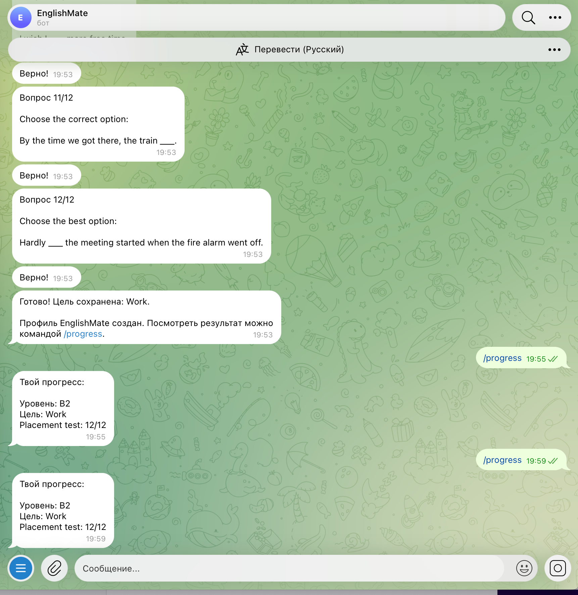

University: [ITMO University](https://itmo.ru/ru/)
Faculty: [FICT](https://fict.itmo.ru)
Course: Vibe Coding: AI-боты для бизнеса
Year: 2026/2027
Group: U4225
Author: Maria Milkina
Lab: Lab1
Date of create: 02.10.2026
Date of finished:

# Лабораторная работа №1

## Описание задачи

В рамках лабораторной работы был разработан Telegram-бот **EnglishMate** — персональный помощник для изучения английского языка.

Основная идея проекта: пользователь проходит короткий placement test, получает ориентировочную стартовую оценку уровня английского, выбирает цель обучения и затем может проходить персонализированные уроки прямо в Telegram.

Бот решает следующие задачи:

- проводит placement test из 12 вопросов;
- определяет ориентировочный уровень A1–B2;
- позволяет выбрать цель обучения;
- сохраняет профиль пользователя;
- формирует персональный урок;
- поддерживает задания с inline-кнопками и свободным текстовым ответом;
- проверяет ответы и даёт краткие объяснения;
- сохраняет результаты уроков;
- показывает прогресс пользователя.

Placement test используется только для первичной оценки стартовой сложности и не является полноценной CEFR-сертификацией.

## Почему была выбрана эта задача

Идея EnglishMate была выбрана, потому что Telegram удобен для коротких регулярных образовательных сценариев: пользователю не требуется устанавливать отдельное приложение, а тестирование, уроки и просмотр прогресса доступны в одном чате.

Кроме того, проект позволяет использовать несколько возможностей Telegram Bot API:

- команды;
- inline-кнопки;
- callback query;
- обработку текстовых сообщений;
- хранение пользовательского состояния;
- сохранение данных;
- персонализацию сценария.

## Функционал итоговой версии

Доступные команды:

- `/start` — пройти или повторить placement test;
- `/lesson` — начать персональный урок;
- `/progress` — посмотреть сохранённый прогресс;
- `/help` — показать помощь.

### Placement test

Тест состоит из 12 вопросов. Каждый вопрос содержит четыре варианта ответа в виде inline-кнопок.

После завершения теста бот:

1. подсчитывает количество правильных ответов;
2. определяет ориентировочную стартовую сложность A1, A2, B1 или B2;
3. предлагает выбрать цель обучения.

Доступные цели:

- General English;
- Speaking;
- Travel;
- Work.

### Персональный урок

Команда `/lesson` получает из SQLite сохранённые уровень и цель пользователя и подбирает соответствующий набор заданий.

Один урок состоит из пяти заданий двух типов:

1. **Multiple choice** — четыре варианта ответа через inline-кнопки.
2. **Свободный ответ** — пользователь вводит слово, фразу или предложение самостоятельно.

После каждого ответа бот сообщает, правильно ли выполнено задание, показывает корректный вариант при необходимости и даёт краткое объяснение.

После пяти заданий бот показывает:

- результат X/5;
- процент выполнения;
- краткий комментарий;
- рекомендацию по дальнейшей практике.

Результат сохраняется в SQLite.

## Промпт для LLM

Для разработки использовался ChatGPT.

Разработка велась итеративно: сначала была создана базовая версия, затем после тестирования были сформулированы отдельные промпты на исправление проблем и расширение функционала.

### Исходный промпт

Полный исходный промпт сохранён в файле `prompt_v1.md`.

Основные требования исходного промпта:

- создать Telegram-бота EnglishMate на Python;
- использовать библиотеку `python-telegram-bot`;
- реализовать `/start`;
- создать placement test из 12 вопросов;
- показывать четыре варианта ответа через inline-кнопки;
- определить ориентировочный уровень A1–B2;
- предложить выбор цели обучения;
- сохранять профиль пользователя в SQLite;
- реализовать `/progress` и `/help`;
- хранить Telegram Bot Token через `.env`;
- создать `bot.py`, `database.py`, `requirements.txt`, `.env.example` и `README.md`.

## Итерации и улучшения

### Итерация 1 — базовая версия

В первой версии были реализованы:

- `/start`;
- placement test;
- inline-кнопки;
- определение уровня;
- выбор цели;
- SQLite;
- `/progress`;
- `/help`.

При тестировании были обнаружены две проблемы:

- ответы на inline-кнопки иногда приходили с заметной задержкой;
- в логах периодически появлялась ошибка `telegram.error.TimedOut`.

В отдельных случаях пользователю приходилось нажимать кнопку повторно.

### Итерация 2 — стабильность и скорость

Полный промпт второй итерации сохранён в `prompt_v2.md`.

Во второй версии были добавлены:

- быстрое подтверждение callback query;
- защита от повторной обработки одного ответа;
- оптимизация количества запросов к Telegram API;
- увеличенные сетевые timeout;
- обработка `TimedOut`;
- обработка временных сетевых ошибок;
- более понятное логирование.

После этого работа inline-кнопок стала стабильнее и быстрее.

### Итерация 3 — персональные уроки

Полный промпт третьей итерации сохранён в `prompt_v3.md`.

В третьей версии были добавлены:

- команда `/lesson`;
- персонализация по уровню пользователя;
- персонализация по цели обучения;
- урок из пяти заданий;
- multiple choice;
- свободный текстовый ответ;
- объяснение после каждого задания;
- сохранение результатов уроков в SQLite;
- расширенная статистика `/progress`.

### Финальный промпт

Финальным промптом для текущей версии проекта является `prompt_v3.md`, так как он содержит требования к итоговому функционалу и сохраняет улучшения стабильности из второй итерации.

## Финальная логика работы

```text
/start
↓
Placement test
↓
12 вопросов
↓
Определение уровня A1–B2
↓
Выбор цели обучения
↓
Сохранение профиля в SQLite
↓
/lesson
↓
Персональный урок из 5 заданий
↓
Проверка ответов и объяснения
↓
Сохранение результата
↓
/progress
```

## Стек технологий

В проекте использованы:

- Python 3.9;
- `python-telegram-bot 22.5`;
- SQLite;
- `python-dotenv`;
- Telegram Bot API;
- BotFather;
- GitHub;
- ChatGPT как LLM для генерации и итеративного улучшения кода.

### Почему были выбраны эти технологии

**Python** — простой язык с удобной экосистемой для Telegram-ботов.

**python-telegram-bot** — используется для обработки команд, сообщений, inline-кнопок и callback query.

**SQLite** — подходит для локального хранения пользовательских данных и не требует отдельного сервера базы данных.

**python-dotenv** — позволяет хранить секретный Telegram Bot Token вне исходного кода.

## Хранение данных

В таблице пользователей сохраняются:

- Telegram ID;
- username;
- имя;
- уровень английского;
- выбранная цель;
- результат placement test.

Отдельно сохраняются результаты завершённых уроков:

- Telegram ID;
- уровень;
- цель;
- количество правильных ответов;
- количество заданий;
- процент выполнения;
- дата завершения.

Благодаря этому `/progress` работает после перезапуска приложения.

## Безопасность

Telegram Bot Token не хранится в исходном коде.

Локально используется файл `.env`:

```text
TELEGRAM_BOT_TOKEN=YOUR_REAL_TOKEN
```

В GitHub загружается только `.env.example`.

Файл `.env` исключён из Git через `.gitignore`.

## Запуск проекта

### 1. Перейти в папку проекта

```bash
cd lab1
```

### 2. Создать виртуальное окружение

```bash
python3 -m venv .venv
```

### 3. Активировать окружение

Для macOS/Linux:

```bash
source .venv/bin/activate
```

### 4. Установить зависимости

```bash
python3 -m pip install -r requirements.txt
```

### 5. Создать `.env`

На основе `.env.example` создать локальный файл `.env`:

```text
TELEGRAM_BOT_TOKEN=YOUR_TELEGRAM_BOT_TOKEN
```

### 6. Запустить бота

```bash
python3 bot.py
```

## Скриншоты работы бота

### Запуск EnglishMate

Команда `/start` и стартовая кнопка определения уровня.


### Результат placement test

После прохождения теста бот показывает ориентировочный уровень и предлагает выбрать цель обучения.


### Сохранение профиля

Команда `/progress` отображает сохранённые уровень, цель и результат placement test.


### Сохранение данных после перезапуска

После перезапуска приложения данные профиля остаются доступны благодаря SQLite.



### Команда help

Команда `/help` показывает список доступных команд.


### Персональный урок

Команда `/lesson` формирует урок с учётом уровня и выбранной цели.


### Свободный текстовый ответ

В уроке присутствуют задания, где пользователь вводит ответ самостоятельно.


### Результат урока

После пяти заданий бот рассчитывает итоговый результат и процент выполнения.


### Общий прогресс

Команда `/progress` показывает количество завершённых уроков и средний результат.


## Видео-демо

Видео-демонстрация работы бота длительностью 2–3 минуты:

`ССЫЛКА_НА_YOUTUBE_ИЛИ_GOOGLE_DRIVE`

## Трудности и решения

### Несовместимость версии библиотеки

Первоначально использовалась версия:

```text
python-telegram-bot==22.8
```

На компьютере использовался Python 3.9.6, и установка этой версии библиотеки не выполнялась.

Проект был адаптирован под:

```text
python-telegram-bot==22.5
```

Также код был приведён к синтаксису, совместимому с Python 3.9.

### Сетевые timeout

Во время тестирования периодически возникала ошибка:

```text
telegram.error.TimedOut
```

Из-за этого inline-кнопки иногда реагировали с задержкой.

Для решения проблемы:

- были увеличены сетевые timeout;
- добавлена обработка временных сетевых ошибок;
- оптимизирована обработка callback query;
- добавлена защита от двойных нажатий;
- уменьшено количество последовательных запросов к Telegram API.

### Проверка свободных ответов

В текущей версии свободный ответ проверяется по заранее определённым допустимым формулировкам после нормализации текста.

Такой подход является предсказуемым для лабораторной работы, но ограничивает количество допустимых правильных формулировок.

В дальнейшем можно подключить LLM для более гибкой проверки ответа, исправления грамматики и генерации персональной обратной связи.

## Выводы

В ходе лабораторной работы был разработан работающий Telegram-бот **EnglishMate**.

Реализован полный сценарий от первичной оценки уровня до прохождения персонального урока и сохранения результатов.

В процессе выполнения лабораторной работы были изучены:

- создание Telegram-бота через BotFather;
- Telegram Bot API;
- inline-кнопки и callback query;
- работа с SQLite;
- переменные окружения;
- обработка сетевых ошибок;
- хранение пользовательского прогресса;
- персонализация заданий;
- итеративное улучшение проекта с помощью LLM.

Использование LLM позволило последовательно создавать и улучшать проект через промпты, тестирование и корректировку требований без ручного написания всего кода с нуля.

В дальнейшем EnglishMate можно развить за счёт:

- генерации заданий через LLM;
- интеллектуальной проверки свободных ответов;
- анализа слабых тем пользователя;
- ежедневных уроков;
- напоминаний;
- интервального повторения слов;
- speaking practice и работы с голосовыми сообщениями.
