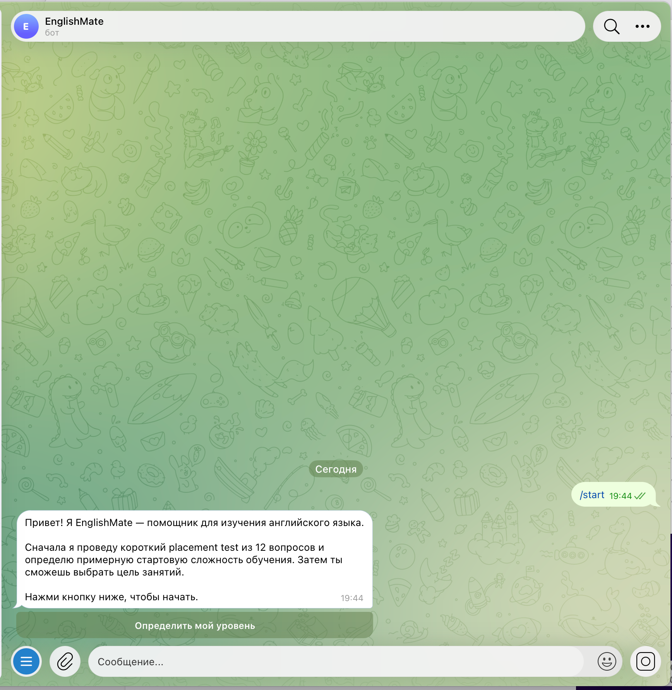
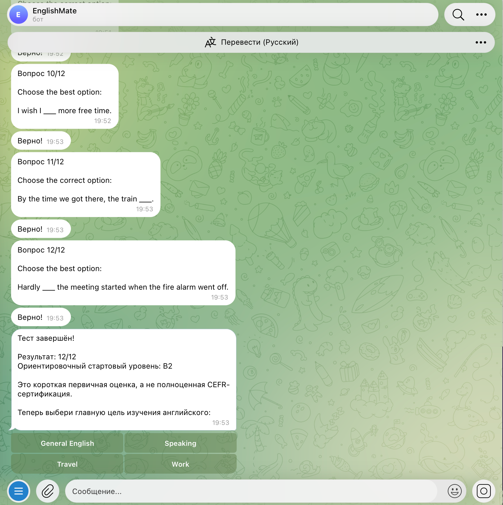
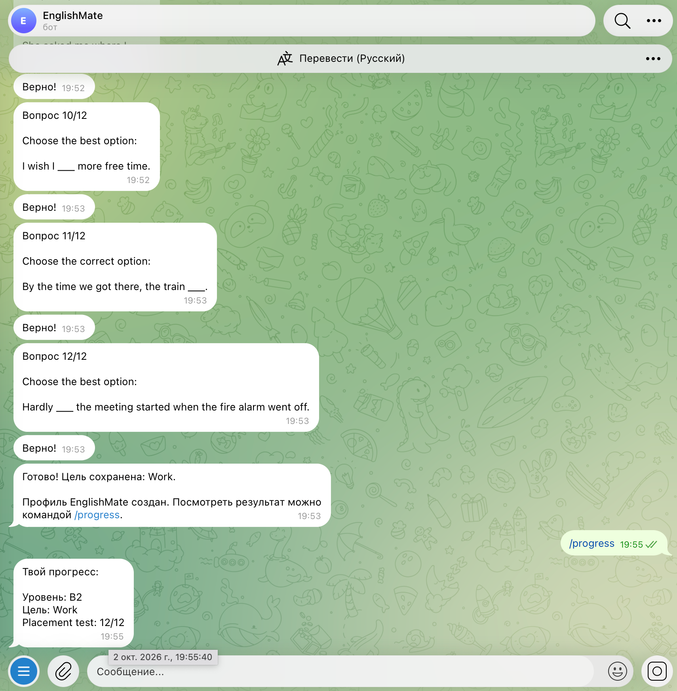
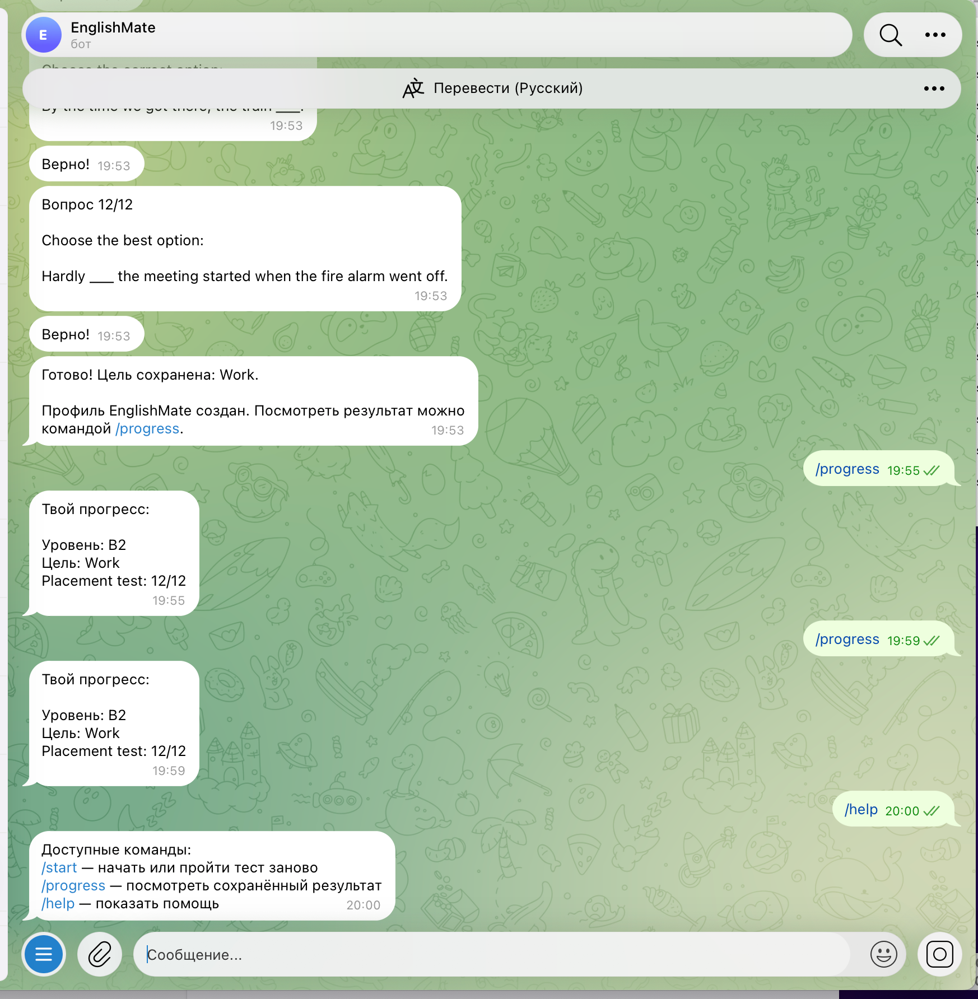
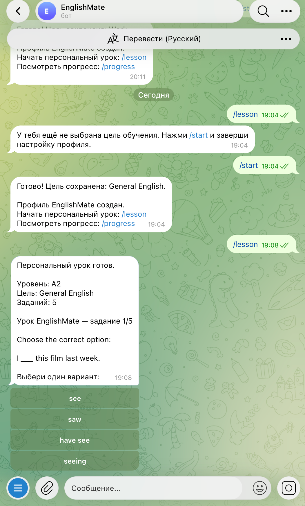
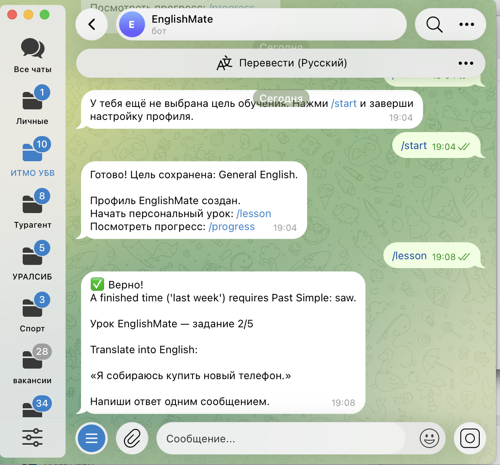
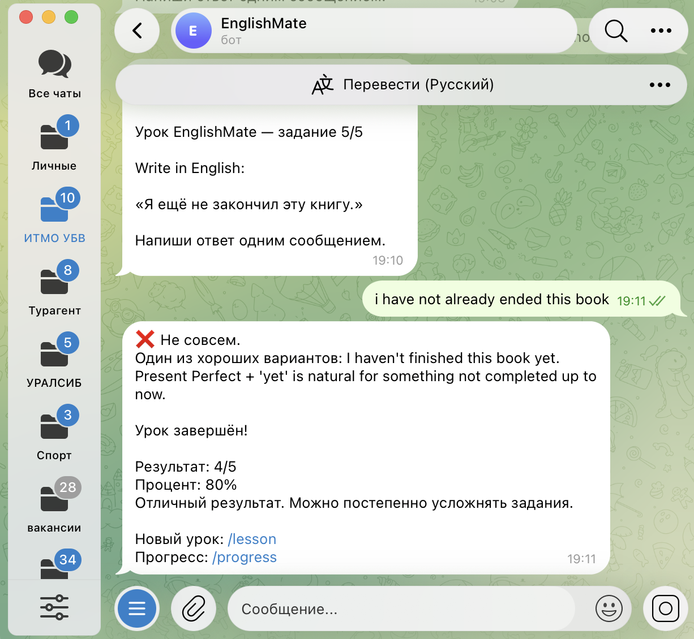
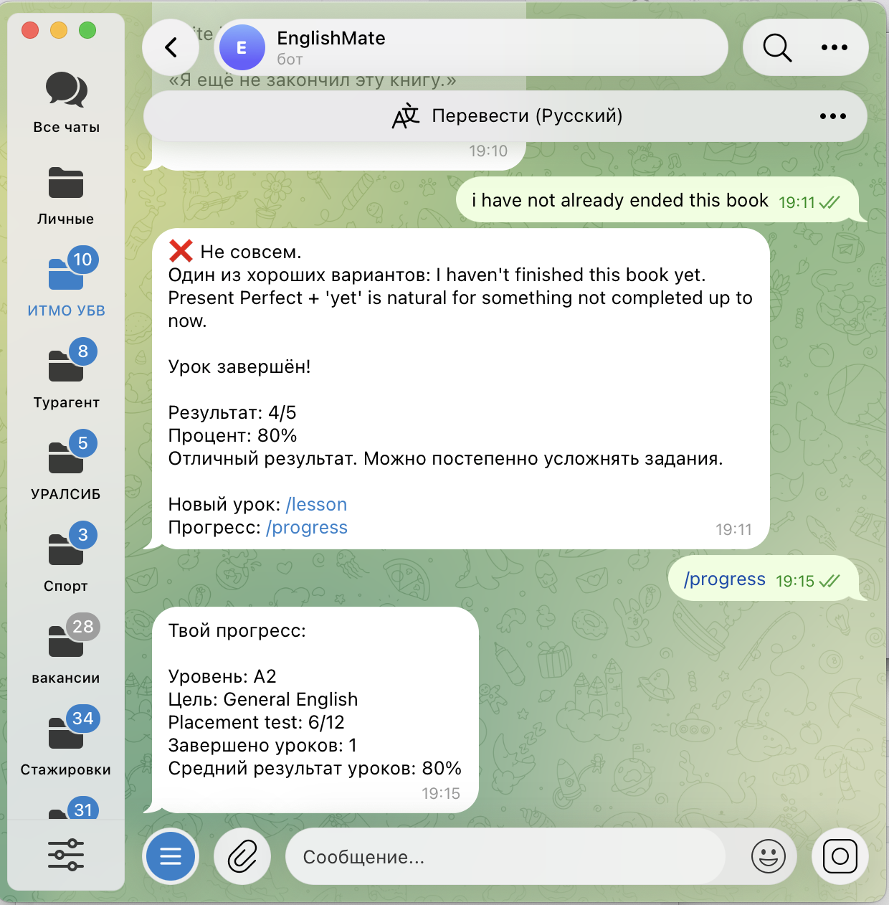

University: [ITMO University](https://itmo.ru/ru/)  
Faculty: [FICT](https://fict.itmo.ru)  
Course: Vibe Coding: AI-боты для бизнеса  
Year: 2026/2027  
Group: U4225  
Author: Maria Milkina  
Lab: Lab1  
Date of create: 02.10.2026  
Date of finished:  

# Лабораторная работа №1. EnglishMate

## Описание задачи

Для первой лабораторной я сделала Telegram-бота **EnglishMate** для изучения английского языка.

При первом запуске бот предлагает пройти короткий тест из 12 вопросов. После теста он определяет примерный уровень пользователя от A1 до B2 и предлагает выбрать цель обучения: General English, Speaking, Travel или Work.

После этого можно запустить персональный урок командой `/lesson`. Урок состоит из 5 заданий: часть заданий выполняется через кнопки, часть — обычным текстовым сообщением. После каждого ответа бот показывает, верно ли выполнено задание, и даёт короткое объяснение.

Результаты теста и уроков сохраняются в SQLite, поэтому их можно посмотреть через `/progress` даже после перезапуска бота.

Я выбрала эту тему, потому что такой бот может быть полезен не только в рамках лабораторной. Его можно развивать дальше: добавлять ежедневные уроки, напоминания, голосовые задания и более умную проверку свободных ответов.

## Промпт для LLM

Для разработки использовался ChatGPT.

Сначала был составлен базовый промпт на создание Telegram-бота с placement test, inline-кнопками, SQLite и командами `/start`, `/progress` и `/help`. Полная версия сохранена в файле `prompt_v1.md`.

После запуска первой версии выяснилось, что бот иногда медленно реагирует на кнопки, а в терминале появляется `telegram.error.TimedOut`. Для этого был составлен второй промпт — `prompt_v2.md`. В нём я попросила оптимизировать обработку callback-запросов, добавить защиту от повторных нажатий и обработку сетевых ошибок.

После этого был сделан `prompt_v3.md`, в котором к уже работающему боту добавилась команда `/lesson`, персональные уроки по уровню и цели пользователя, задания со свободным ответом и сохранение результатов уроков.

Таким образом, код получался не за один запрос, а дорабатывался после реального тестирования.

## Стек технологий

- Python 3.9
- `python-telegram-bot 22.5`
- SQLite
- `python-dotenv`
- Telegram Bot API
- BotFather
- GitHub
- ChatGPT

Токен Telegram хранится локально в `.env`. В репозиторий добавлен только `.env.example`, сам `.env` в GitHub не загружается.

Для запуска проекта:

```bash
python3 -m venv .venv
source .venv/bin/activate
python3 -m pip install -r requirements.txt
python3 bot.py
```

## Скриншоты и видео

Запуск бота и команда `/start`:



Результат placement test и выбор цели:



Проверка сохранённого профиля через `/progress`:



Команда `/help`:



Запуск персонального урока:



Задание со свободным ответом:



Результат урока:



Обновлённый прогресс после прохождения урока:



Видео-демо работы EnglishMate: [Google Drive](https://drive.google.com/file/d/1kRe4k5h-QPwQ9Fdh5FrIjti5HakW4pu_/view?usp=sharing)

## Трудности и решения

Первая проблема появилась при установке зависимостей. Изначально в проекте была указана версия `python-telegram-bot==22.8`, которая не установилась на Python 3.9.6. Поэтому версия библиотеки была заменена на `22.5`, а код приведён к совместимому с Python 3.9 виду.

Вторая проблема появилась уже во время тестирования бота. Иногда после нажатия на inline-кнопку ответ приходил с задержкой, а в логах появлялась ошибка `TimedOut`. После второй итерации промпта были увеличены timeout, добавлена обработка сетевых ошибок и защита от повторной обработки одного ответа. После этого бот стал работать заметно стабильнее.

Ещё один момент связан со свободными ответами. Сейчас бот сравнивает ответ пользователя с заранее заданными допустимыми вариантами. Для лабораторной этого достаточно, но в дальнейшем такую проверку лучше заменить на LLM, чтобы бот понимал разные корректные формулировки.

## Выводы

В результате получился работающий Telegram-бот, который умеет определить примерный уровень английского, сохранить цель обучения, выдать персональный урок, проверить ответы и показать прогресс.

Во время работы я попробовала не только сгенерировать код через LLM, но и дорабатывать его по результатам тестирования. Самые полезные доработки появились именно после запуска первой версии: исправление сетевых задержек и добавление персональных уроков.

Дальше EnglishMate можно развивать через LLM-проверку свободных ответов, ежедневные уроки, напоминания и голосовую практику.
