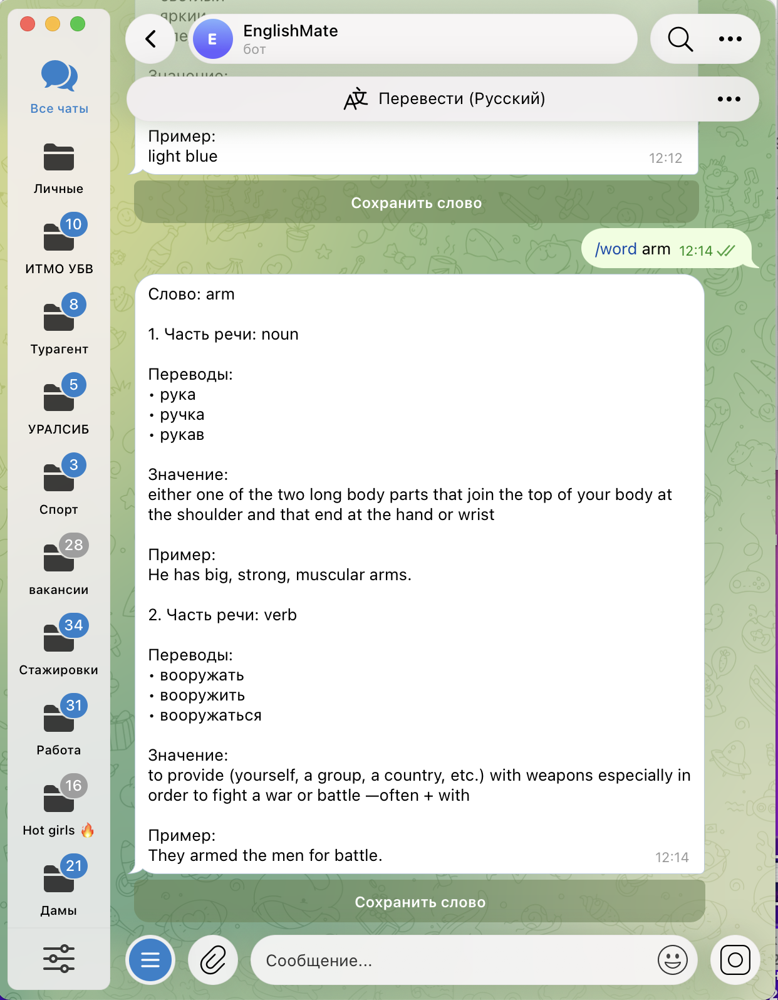
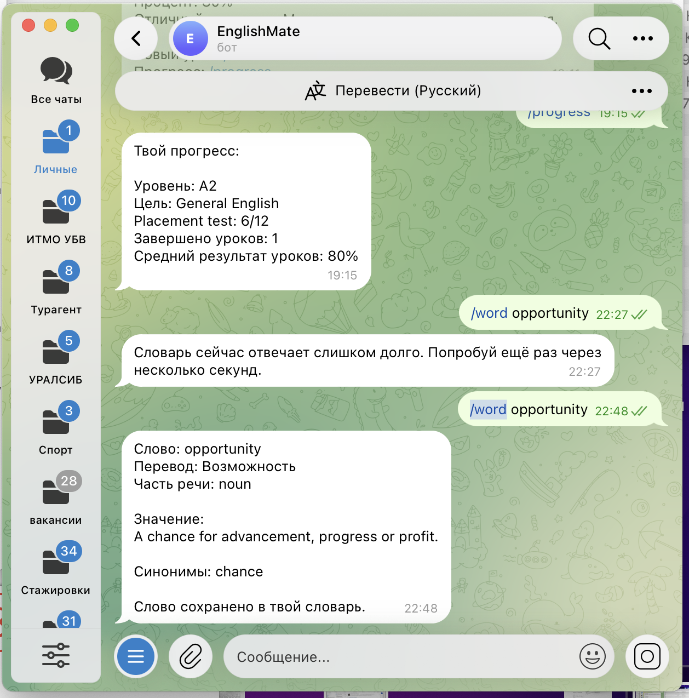
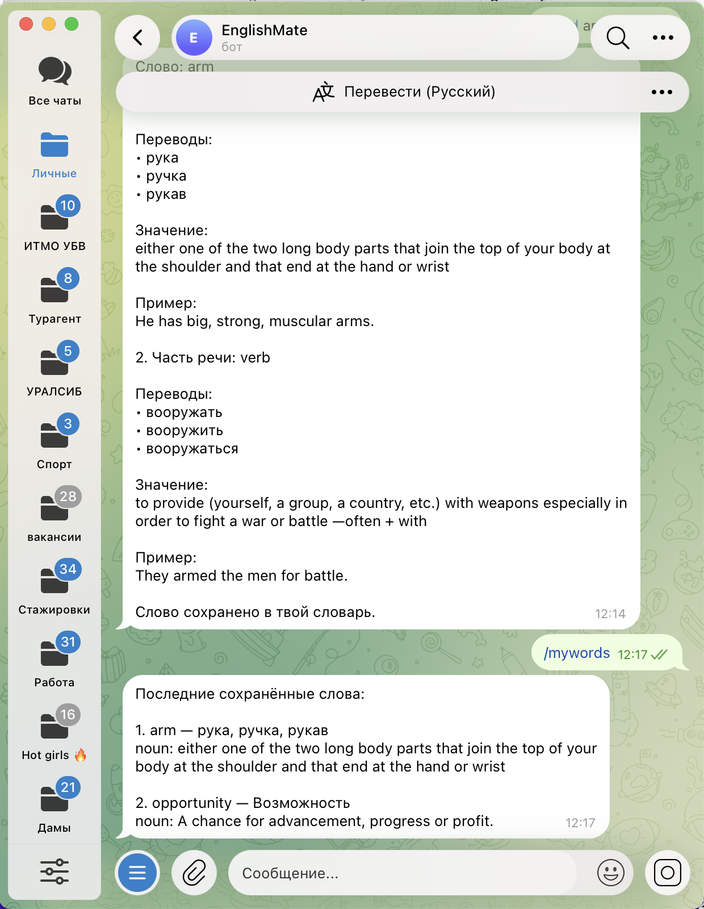
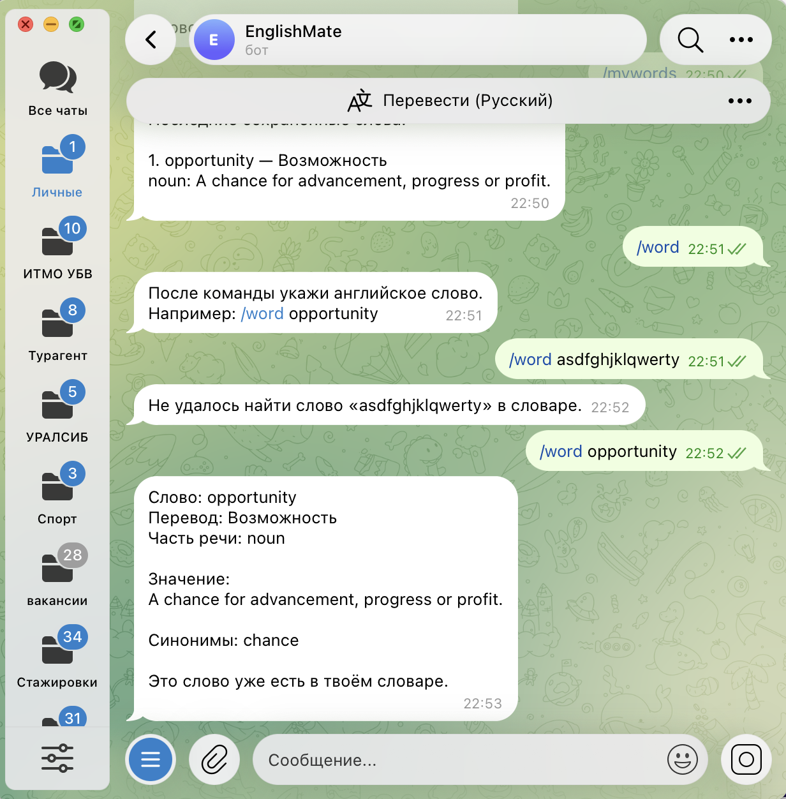
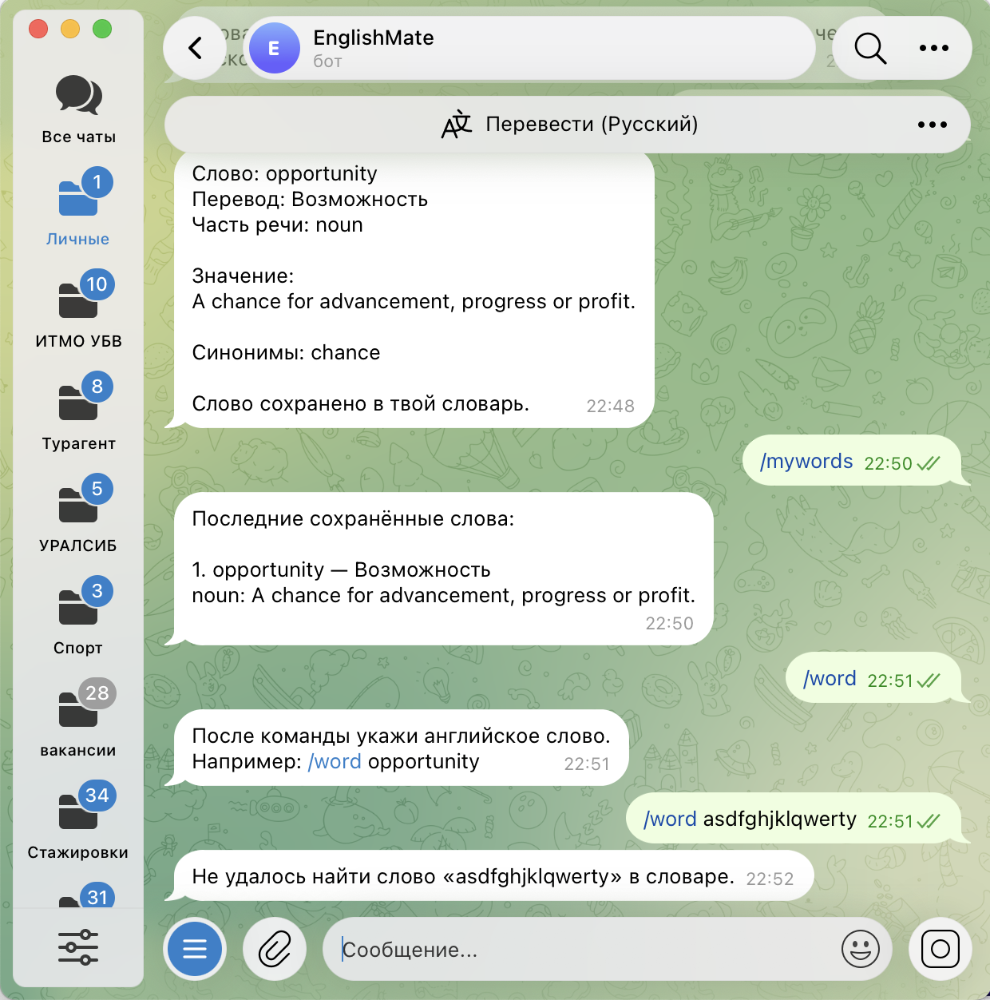

University: [ITMO University](https://itmo.ru/ru/)  
Faculty: [FICT](https://fict.itmo.ru)  
Course: Vibe Coding: AI-боты для бизнеса  
Year: 2026/2027  
Group: U4225  
Author: Maria Milkina  
Lab: Lab2  
Date of create: 04.10.2026  
Date of finished:  

**Лабораторная работа №2. Подключение бота к данным**

### Описание

Во второй лабораторной работе я продолжила развивать Telegram-бота EnglishMate из первой работы и добавила работу с внешними данными.

Новая функция позволяет искать английские слова через команду `/word`, получать словарную информацию из внешних источников и сохранять слова в личный словарь пользователя.

Также добавлена команда `/mywords`, которая показывает последние сохранённые слова из SQLite.

### Источники данных

В финальной версии используются:

- **Merriam-Webster Learner's Dictionary API** — часть речи, английское определение и пример использования;
- **Wiktionary** — русские переводы слова;
- **SQLite** — хранение сохранённых слов пользователя.

Merriam-Webster был выбран как основной словарный источник, потому что он ориентирован на изучающих английский и даёт понятные определения и примеры.

Wiktionary используется для получения нескольких русских переводов. Это оказалось удобнее, чем один машинный перевод, потому что у одного английского слова могут быть разные значения и разные части речи.

### Структура данных

При поиске слова бот может получить и обработать:

- слово;
- часть речи;
- несколько русских переводов;
- английское определение;
- пример использования.

Если у слова есть несколько распространённых частей речи, бот показывает до двух блоков.

Например, для `arm` отдельно выводятся `noun` и `verb`, и для каждой части речи показываются свои переводы и определение.

При сохранении слова в SQLite сохраняются основные данные карточки пользователя.

### Промпты и итерации

Разработка велась через несколько версий промпта.

`prompt_v1.md` — первая версия словаря. В ней использовался Free Dictionary API и сохранение слов в SQLite.

Во время тестирования первый API периодически не отвечал и вызывал timeout, поэтому в `prompt_v2.md` источник был заменён на Datamuse API.

Datamuse работал стабильнее, но результат оказался неудобным для учебного бота: появлялись лишние определения и не всегда полезные данные.

В `prompt_v3.md` карточка была упрощена, а для русского перевода был добавлен MyMemory. После тестирования стало заметно, что машинный перевод иногда выбирает странное значение. Например, для обычного английского слова мог показываться не самый распространённый перевод.

Поэтому в `prompt_v4.md` словарь был переделан ещё раз. Основным источником стал Merriam-Webster Learner's Dictionary API, а русские переводы стали получаться из Wiktionary.

После этого была сделана небольшая доработка финальной версии: переводы стали разделяться по частям речи. Например, для `arm` бот отдельно показывает переводы для `noun` и `verb`.

### Реализация

Добавлены команды:

- `/word <слово>` — поиск английского слова;
- `/mywords` — просмотр последних сохранённых слов.

Пример:

`/word arm`

Бот показывает:

- часть речи;
- до трёх русских переводов;
- одно основное определение;
- пример использования.

Если у слова есть несколько основных частей речи, данные выводятся отдельными блоками.

После поиска можно нажать кнопку **«Сохранить слово»**.

При повторной попытке сохранить то же слово бот не создаёт дубль и сообщает, что слово уже есть в словаре.

### Библиотеки и технологии

- Python 3.9
- `python-telegram-bot 22.5`
- `httpx`
- `python-dotenv`
- SQLite
- Merriam-Webster Learner's Dictionary API
- Wiktionary
- GitHub

Telegram Bot Token и Merriam-Webster API key хранятся только локально в `.env`.

В GitHub находится только `.env.example` с примерами переменных:

```text
TELEGRAM_BOT_TOKEN=your_bot_token_here
MERRIAM_WEBSTER_API_KEY=your_merriam_webster_api_key_here
```

### Запуск

```bash
python3 -m venv .venv
source .venv/bin/activate
python3 -m pip install -r requirements.txt
python3 bot.py
```

### Тестирование

Были проверены основные сценарии работы.

Поиск слова:



На примере `arm` видно, что бот отдельно обрабатывает `noun` и `verb`, показывает разные переводы, определения и примеры.

Сохранение слова:



Просмотр сохранённых слов:



Проверка защиты от дублей:



Обработка ошибок:



Также дополнительно проверялось слово `light`, у которого разные переводы для `noun` и `adjective`. Это подтвердило, что разделение по частям речи работает не только на одном примере.

### Обработка ошибок

Бот обрабатывает несколько ситуаций:

- команда `/word` без слова;
- неизвестное слово;
- временная ошибка внешнего API;
- отсутствие перевода;
- отсутствие примера;
- повторное сохранение слова.

Если дополнительный источник перевода временно недоступен, бот всё равно старается показать данные, которые удалось получить из Merriam-Webster.

### Видео-демо

Видео работы Lab 2: [Google Drive](https://drive.google.com/file/d/1qA_DvnRMh4wM0zwTWN3LD12s2p91wk26/view?usp=drivesdk)

### Трудности и решения

Главная сложность была не в самой отправке запросов к API, а в выборе подходящего источника данных.

Первая версия оказалась нестабильной из-за timeout.

Datamuse работал лучше, но давал не самый удобный набор данных для учебного словаря.

MyMemory позволил добавить русский перевод, но иногда выбирал странное значение слова.

После нескольких итераций была собрана более подходящая схема: Merriam-Webster отвечает за английскую словарную информацию, а Wiktionary — за несколько русских переводов.

Ещё одна доработка понадобилась для слов с несколькими частями речи. В финальной версии переводы разделяются по `noun`, `verb`, `adjective` и другим основным частям речи, если такие данные есть.

### Вывод

В результате EnglishMate получил работу с несколькими источниками данных.

Бот умеет получать словарную информацию из внешних сервисов, обрабатывать ответ, показывать разные значения слова по частям речи и сохранять выбранные слова в SQLite.

Также были проверены успешные сценарии и обработка ошибок. По сравнению с первой версией словаря финальная карточка стала понятнее и полезнее для изучения английского.
